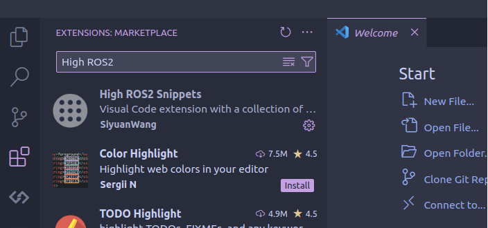
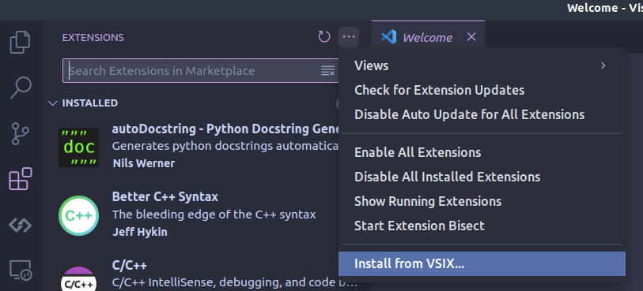

# High-ROS2-Snippets
Visual Code extension with a collection of ROS2 (Robot Operating System 2) snippets for rclcpp, rclpy, launch(xml, python), CMakelists.txt, package.xml, urdf files.

## Installation

### Install from the marketplace
- You can search `High-ROS2-Snippets` in the VScode MarketPlace, then click the install button without any effort.



### Install from the `.vsix` file manually
- Download the `.vsix` file in this repository, then install it through VScode UI interface.



## How to export `.vsix` file
> Not for nomal users, this is needed only if you made changes to the snippets and want new changes work in VScode.

1. make sure `vsce` is installed:

```
npm install -g vsce
```

2. under the extension dir, run:
```
vsce package
```

## Reference
- https://github.com/SweiLz/ROS-Snippets
